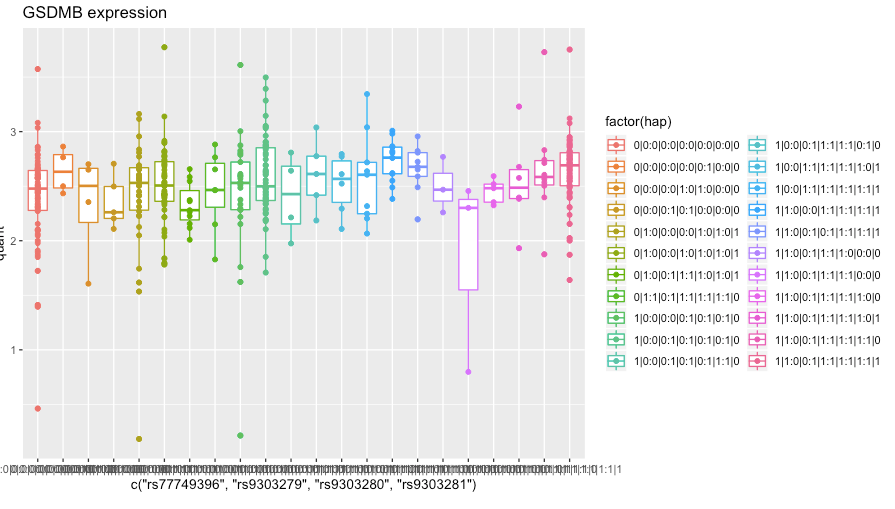

# Compound heterozygotes within populations
The project aims to look at compound heterozygotes within populations. We used [phASER](https://github.com/secastel/phaser) to extract compound heterozygots from RNA-seq data. 

Data:
phASER uses two types of information genotype and expression. 
We used the phased VCF files and RNA-seq data from the E-GEUV-1 project. 

Genotype:
https://www.ebi.ac.uk/arrayexpress/experiments/E-GEUV-1/files/genotypes/
RNA-seq:
https://www.ebi.ac.uk/arrayexpress/experiments/E-GEUV-1/files/processed/

We build a R package (https://github.com/vjcitn/BiocRnaHap) to inspect compound heterozygotes from the haplotype.txt provided by phaser.

